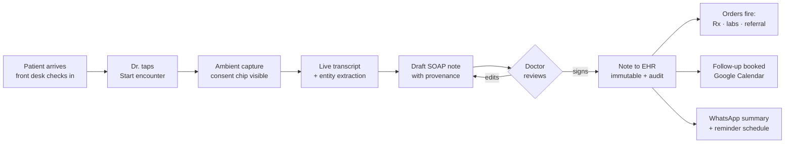
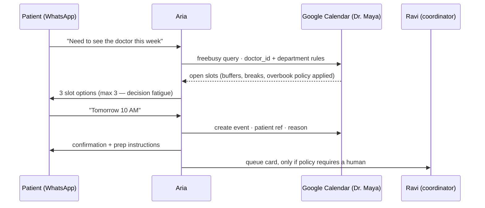
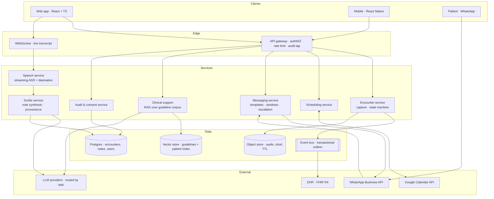

# ARIA — Ambient AI Healthcare Assistant
### Product Design & Wireframe Specification · v1.0

> **One line:** Aria listens during the visit, writes the note, books the follow-up, messages the patient on WhatsApp, and surfaces cited clinical evidence — so Dr. Maya spends her day on patients, not paperwork.

---

## Table of contents

1. [Product thesis](#1-product-thesis)
2. [Users, jobs & success metrics](#2-users-jobs--success-metrics)
3. [Information architecture](#3-information-architecture)
4. [Core journeys](#4-core-journeys)
5. [Visual language — how the product looks](#5-visual-language--how-the-product-looks)
6. [Design tokens](#6-design-tokens)
7. [Wireframes](#7-wireframes)
8. [Component library](#8-component-library)
9. [Trust, safety & human-in-the-loop patterns](#9-trust-safety--human-in-the-loop-patterns)
10. [States: empty, loading, error, degraded](#10-states-empty-loading-error-degraded)
11. [Responsive & accessibility](#11-responsive--accessibility)
12. [Scalability: product, design system, platform](#12-scalability-product-design-system-platform)
13. [Reference architecture](#13-reference-architecture)
14. [Instrumentation](#14-instrumentation)
15. [Release phasing](#15-release-phasing)

---

## 1. Product thesis

**Problem.** A 23-minute patient encounter contains ~10 minutes of medicine and ~13 minutes of clerical work: typing notes, booking the follow-up, sending the prescription, chasing reminders, digging through history. At 100 patients a day that is not an inconvenience — it is the bottleneck of the practice.

**Product.** An ambient assistant that sits beside the clinician — never between the clinician and the patient — and absorbs the clerical layer.

**Design stance.** Three non-negotiables that shape every screen in this document:

| Principle | What it means on screen |
| --- | --- |
| **The clinician signs, always** | Nothing AI-generated enters the record until a human signs it. Draft state is visually unmistakable. |
| **Show your work** | Every AI claim carries provenance — the transcript span it came from, or the guideline it cites. One click to the source. |
| **Calm by default** | Colour is reserved for clinical signal. A screen with nothing wrong is nearly monochrome. Alarm fatigue is a design failure. |

**What Aria is not:** a diagnostician, an autonomous agent that messages patients unsupervised, or a replacement for the EHR. It is the connective tissue between the doctor's voice, the EHR, Google Calendar, and WhatsApp.

---

## 2. Users, jobs & success metrics

### Personas

| | **Dr. Maya Rao** — Clinician (primary) | **Ravi** — Front desk / coordinator | **Priya** — Practice admin / compliance |
| --- | --- | --- | --- |
| Context | 80–100 patients/day, 6–8 min per encounter, on her feet | Owns the queue, the phone, the no-shows | Owns templates, access, audit, billing |
| Wants | "Don't make me type. Don't make me hunt." | "Never double-book. Never miss a reminder." | "Prove every AI action, and who approved it." |
| Fears | A wrong note under her signature | An angry patient at the front desk | An audit she can't answer |
| Primary surface | Web app + mobile (pocket) | Web app — Inbox & Schedule | Web app — Admin & Audit |

### Jobs to be done → product surface

| JTBD | Surface |
| --- | --- |
| Capture what was said, as a signable note | **Live Encounter** → **Note Review** |
| Find this patient's history in seconds | **Patient 360** timeline |
| Book the follow-up without leaving the room | **Smart Scheduling** on Google Calendar |
| Keep the patient informed and adherent | **WhatsApp Inbox** + reminder automations |
| Sanity-check a differential | **Clinical Support** drawer (evidence-cited) |
| Prove the system is safe and worth it | **Insights** + **Audit log** |

### North-star & guardrail metrics

- **North star:** *documentation minutes saved per clinician per day.* Target ≥ 45 min by week 4.
- **Quality:** note edit-distance at signing < 12% · sign-off within 5 min of encounter close ≥ 90%.
- **Trust:** AI suggestion acceptance 55–75% (below = useless, above = rubber-stamping — both are alarms).
- **Safety:** zero unsigned notes reaching the EHR · 100% of outbound patient messages traceable to a template and an approver.
- **Guardrail:** encounter face-time must not *drop*. If the doctor spends the saved minutes on the screen, the product failed.

---

## 3. Information architecture

```
ARIA
│
├── Today ····························· command centre; the default screen, opens on login
│     ├── Now / Next / Waiting queue
│     ├── Action Required (unsigned notes, approvals, red flags)
│     └── Live Encounter ▸ Note Review ▸ Sign
│
├── Patients
│     ├── Search & recent
│     └── Patient 360 ▸ Timeline · Notes · Meds · Labs · Messages · Documents
│
├── Schedule ·························· Google Calendar (two-way sync, doctor-scoped)
│     ├── Day / Week / Agenda
│     ├── Availability rules & buffers
│     └── Booking requests from patients
│
├── Inbox ····························· WhatsApp Business + SMS fallback
│     ├── Threads (assigned / unassigned / bot-handled)
│     ├── Approval queue (AI drafts awaiting a human)
│     └── Broadcasts & reminder campaigns
│
├── Insights ·························· time saved, note quality, no-show rate, AI acceptance
│
└── Admin
      ├── Team & roles (doctor_id, name, email, department)
      ├── Note templates & specialty macros
      ├── Integrations (EHR · Google Calendar · WhatsApp · Labs)
      └── Audit log & data residency
```

**Navigation model.** A persistent left rail with six destinations (icon + label, never collapses below `lg`). Everything else is a **drawer** over the current context — Clinical Support, Patient peek, message composer — because a clinician mid-encounter must never lose their place.

**⌘K is a first-class citizen.** The command palette does: *find patient · start encounter · book slot · message patient · insert template · sign note*. A power user should be able to run an entire clinic without touching the rail.

---

## 4. Core journeys

### J1 — The encounter (the hero loop)



**Time budget:** capture is passive (0 min of doctor time). Review-and-sign target: **under 60 seconds**. Every decision on the Note Review screen is optimised for that one number.

### J2 — Scheduling without a phone call



### J3 — Escalation (the journey that must never fail)

A patient sends *"chest tightness since morning"* → the intent classifier flags a **red-flag symptom** → the bot **stops replying**, sends a safety-netting message, escalates to the on-call human within 60 seconds, and raises a banner on **Today**. Silent failure is impossible: an unacknowledged escalation pages the practice.

---

## 5. Visual language — how the product looks

**In one sentence:** a quiet, paper-white clinical instrument — Swiss typography, hairline structure, one accent colour for the machine and one for danger, and a lot of nothing.

- **Surface.** Near-white canvas (`#F7F8FA`), pure-white cards, **1px hairline borders** instead of shadows for structure. Elevation is reserved for things that genuinely float: drawers, menus, toasts.
- **Density.** Two modes — `Comfortable` for review work, `Compact` for clinic-day lists. An 8pt spatial grid throughout, 4pt inside components.
- **Typography carries hierarchy.** Colour never creates hierarchy; size, weight and space do. UI is **Inter**. The clinical note body is set in a **serif (Source Serif 4)** so it reads like a document rather than an app — a quiet signal that this is the record.
- **Colour discipline.** The interface is neutral except for four meanings:
  - **Pulse blue** — interactive; the human's actions.
  - **Mint** — the machine. Every AI-authored artefact carries a mint left rule and an `AI draft` chip. On signature the mint disappears and the artefact turns neutral-permanent. *You can tell at a glance what a machine wrote and what a person owns.*
  - **Amber / Rose** — needs review / clinical red flag. Nothing else is ever amber or rose.
- **Motion.** Functional only, 120–240 ms, `cubic-bezier(.2,0,0,1)`. The live-transcript caret and the input waveform are the only continuous motion in the product; `prefers-reduced-motion` stops both.
- **Imagery.** None. No illustrations, no stock doctors. The patient's data is the only content.
- **Dark mode** is a re-tint, not an inversion: ink `#0B0F16` canvas, `#141A23` surfaces, mint desaturated to hold AA contrast. Night shifts are real.

**The feeling to aim for:** picking up a well-made instrument. Nothing bounces, nothing celebrates, nothing shouts. It is fast, legible at arm's length, and it gets out of the way.

---

## 6. Design tokens

Tokens are the scalability contract: every colour, space and radius below is a variable, so a hospital tenant can be re-themed without touching a single component.

```jsonc
// tokens.json — a semantic layer sitting on top of a primitive ramp (50…900)
{
  "color": {
    "canvas":         { "light": "#F7F8FA", "dark": "#0B0F16" },
    "surface":        { "light": "#FFFFFF", "dark": "#141A23" },
    "surface.sunken": { "light": "#EEF1F5", "dark": "#0F141C" },
    "border.hairline":{ "light": "#E3E7EE", "dark": "#232C39" },
    "text.primary":   { "light": "#0B1220", "dark": "#EDF1F7" },
    "text.secondary": { "light": "#5A6779", "dark": "#9AA7B8" },
    "text.tertiary":  { "light": "#8B97A8", "dark": "#6C7A8C" },

    "accent.pulse":   { "light": "#1D6FF2", "dark": "#5B9BFF" },  // human / interactive
    "accent.mint":    { "light": "#00A38F", "dark": "#3FD3BC" },  // machine / AI draft
    "signal.review":  { "light": "#B7791F", "dark": "#F0B44A" },  // needs attention
    "signal.danger":  { "light": "#C4373C", "dark": "#FF6B70" },  // clinical red flag
    "signal.ok":      { "light": "#12805C", "dark": "#4CC79A" }   // signed / confirmed
  },
  "font": {
    "ui":   "Inter, -apple-system, 'Segoe UI', sans-serif",
    "note": "'Source Serif 4', Georgia, serif",
    "mono": "'JetBrains Mono', ui-monospace, monospace"
  },
  "type": {                        // size / line-height / weight / tracking
    "display": "28/36/600/-0.02em",
    "title":   "20/28/600/-0.01em",
    "heading": "16/24/600/0",
    "body":    "14/22/400/0",
    "note":    "16/26/400/0",      // serif — clinical prose
    "label":   "12/16/500/0.01em",
    "micro":   "11/16/500/0.04em"  // uppercase meta, timestamps, IDs
  },
  "space":  [0, 2, 4, 8, 12, 16, 24, 32, 48, 64],
  "radius": { "sm": 6, "md": 10, "lg": 14, "pill": 999 },
  "shadow": {
    "raised":  "0 1px 2px rgba(11,18,32,.06)",
    "overlay": "0 12px 32px rgba(11,18,32,.14)"
  },
  "motion": { "fast": "120ms", "base": "180ms", "slow": "240ms",
              "ease": "cubic-bezier(.2,0,0,1)" },
  "z": { "rail": 10, "drawer": 40, "modal": 50, "toast": 60, "escalation": 90 }
}
```

**Layout grid.** 12 columns, 24 px gutters, 1440 px max content width. Rail is a fixed 216 px at `lg+`, 64 px icon-only at `md`.

---

## 7. Wireframes

> Low-fidelity, structure only. Legend: `[ Primary ]` · `( Secondary )` · `‹ chip ›` · `▸` expandable · `◉` live/recording · `▮` mint AI rule · `▲` red flag · `░` external/blocked · `▓` held.

### S-01 · Sign-in — identity is the tenancy boundary

```
┌────────────────────────────────────────────────────────────────────────────────────────────────┐
│                                                                                                │
│                                    A  R  I  A                                                  │
│                        Ambient assistant for clinical teams                                    │
│                                                                                                │
│                     ┌──────────────────────────────────────────────┐                           │
│                     │  Work email                                  │                           │
│                     │  ┌────────────────────────────────────────┐  │                           │
│                     │  │ maya.rao@northbridge.health            │  │                           │
│                     │  └────────────────────────────────────────┘  │                           │
│                     │                                              │                           │
│                     │  [         Continue with SSO           ]     │                           │
│                     │  (     Sign in with Google Workspace   )     │                           │
│                     │                                              │                           │
│                     │  ── second factor required for PHI access ── │                           │
│                     └──────────────────────────────────────────────┘                           │
│                                                                                                │
│               Northbridge Health · ap-south-1 · data stays in region                           │
│                          Privacy   ·   Security   ·   Status                                   │
└────────────────────────────────────────────────────────────────────────────────────────────────┘
```

*Identity resolves `doctor_id · name · email · department` and, with it, the correct Google Calendar and WhatsApp sender identity. One identity, three integrations, zero manual configuration — that is the entire onboarding.*

---

### S-02 · Today — the command centre ★

The screen Dr. Maya lives on. It answers three questions in under two seconds: *who's next, what's blocked on me, what's on fire.*

```
┌────────────────────────────────────────────────────────────────────────────────────────────────┐
│  ARIA        Search patients, notes, slots…            ⌘K      ◑ Theme    Dr. Maya Rao   MR    │
├──────────────┬─────────────────────────────────────────────────────────────────────────────────┤
│              │                                                                                 │
│  ▸ Today     │  Friday, 28 July            Cardiology · Northbridge          [ ◉ Start visit ] │
│    Patients  │                                                                                 │
│    Schedule  │  ┌── SAVED TODAY ───────────┬── QUEUE ────────┬── ACTION REQUIRED ────────────┐ │
│    Inbox   3 │  │  1 h 52 m documentation  │  6 waiting      │  4 items                      │ │
│    Insights  │  │  ▁▂▄▅▇▆▅  vs 42 m manual │  avg wait 9 m   │  2 notes · 1 msg · 1 flag     │ │
│    Admin     │  └──────────────────────────┴─────────────────┴───────────────────────────────┘ │
│              │                                                                                 │
│  ──────────  │  ┌── NOW ─────────────────────────────────────────────────────────────────────┐ │
│              │  │  10:05   John Abraham · 34 M · MRN 44192          Room 3  ‹ Checked in ›   │ │
│  Density     │  │          Fever ×3 days, dry cough                                          │ │
│  ● Compact   │  │          Last visit 12 Apr · Amoxicillin · ‹ Penicillin allergy ›          │ │
│  ○ Comfort   │  │                                                                            │ │
│              │  │          [ ◉ Start encounter ]    ( Open chart )    ( Message )            │ │
│  ──────────  │  └────────────────────────────────────────────────────────────────────────────┘ │
│              │                                                                                 │
│  ⚙ Settings  │  ACTION REQUIRED                                                     Sort ▾     │
│  ? Help      │  ┌────────────────────────────────────────────────────────────────────────────┐ │
│              │  │ ▮ AI draft  Sarah Menon · 09:40 · consultation note       [ Review · 40s ] │ │
│              │  │ ▮ AI draft  Ali Rahman  · 09:15 · follow-up note          [ Review · 25s ] │ │
│              │  │ ▮ AI draft  Reply to Neha K. re: fasting before lipid panel  [ Approve ]   │ │
│              │  │ ▲ RED FLAG  Vikram S. messaged "chest tightness" 08:52    [ Escalated ▸ ]  │ │
│              │  └────────────────────────────────────────────────────────────────────────────┘ │
│              │                                                                                 │
│              │  NEXT UP                                                       Full schedule ▸  │
│              │  ┌────────────────────────────────────────────────────────────────────────────┐ │
│              │  │ 10:20  Sarah Menon    Follow-up · HTN       ‹ Waiting ›     ( Chart )      │ │
│              │  │ 10:35  Ali Rahman     New · chest pain      ‹ Waiting ›     ( Chart )      │ │
│              │  │ 10:50  ——— buffer ———                      auto-held for overrun           │ │
│              │  │ 11:00  Neha Kapoor    Report review        ‹ Confirmed ›   ( Chart )       │ │
│              │  └────────────────────────────────────────────────────────────────────────────┘ │
└──────────────┴─────────────────────────────────────────────────────────────────────────────────┘
```

**Design decisions**

- *Action Required sits above Next Up.* Unsigned work is the only thing that compounds; the schedule will announce itself anyway.
- Every AI-authored row is marked `▮ AI draft`. The eye learns one glyph: "this needs my judgement."
- Review buttons carry an **estimated time** (`40s`). Small detail, large effect — it converts "I'll do it later" into "I'll do it now", which is the single biggest driver of note lag.
- The red-flag row is the only rose element on the page and never scrolls out of the list until it is resolved.
- `Saved today` is on the home screen because the product has to keep re-earning a behaviour change.

---

### S-03 · Live Encounter — ambient capture ★

Designed to be **glanceable, not readable**. The doctor is looking at the patient; this screen is for the corner of her eye.

```
┌────────────────────────────────────────────────────────────────────────────────────────────────┐
│  ◉ RECORDING  09:12   John Abraham · 34 M · MRN 44192          [ Pause ]   [ ■ End & draft ]   │
├────────────────────────────────────────────────────────────────────────────────────────────────┤
│  ‹ Consent captured 10:05 by Dr. M. Rao ›    ‹ Audio processed in-region, not retained ›       │
├─────────────────────────────────────────────┬──────────────────────────────────────────────────┤
│                                             │                                                  │
│   LIVE TRANSCRIPT             Speakers ▾    │   AS I HEAR IT                            ▮ AI   │
│   ▁▃▅▇▅▃▁▂▄▆▄▂▁   input healthy             │   ─────────────────────────────────────────────  │
│                                             │                                                  │
│   Dr.   Tell me what's been happening.      │   SYMPTOMS                                       │
│                                             │   ‹ fever · 3 days ›   ‹ dry cough ›             │
│   Pt.   Fever for about three days now,     │   ‹ breathlessness on exertion ›                 │
│         and a dry cough. Since yesterday    │                                                  │
│         I get breathless climbing stairs.   │   VITALS                                         │
│                                             │   ‹ Temp 38.4 °C ›   ‹ SpO2 94% ›   from device  │
│   Dr.   Any chest pain? Travel recently?    │                                                  │
│                                             │   MEDICATIONS DISCUSSED                          │
│   Pt.   No pain. No travel.                 │   ‹ Paracetamol 500 mg · BD · 5 d ›              │
│                                             │   ! Penicillin allergy on file — amoxicillin     │
│   Dr.   Let's start paracetamol five        │     avoided. Confirm an alternative.             │
│         hundred, twice a day, five days.    │                                                  │
│                                             │   ORDERS FORMING                                 │
│   ▍                                         │   ‹ Chest X-ray PA ›   ‹ CBC ›                   │
│                                             │                                                  │
│   ───────────────────────────────────────   │   ─────────────────────────────────────────────  │
│   ( Mark moment )   ( Correct speaker )     │   ( Open clinical support )    3 suggestions ▸   │
└─────────────────────────────────────────────┴──────────────────────────────────────────────────┘
```

**Design decisions**

- **Consent is a chip, not a modal.** It stays visible for the whole recording so both parties can see it. Ethically and legally load-bearing.
- The right column is *extraction*, not diagnosis — chips, not prose. Chips are cheap to scan and cheap to dismiss.
- The **allergy conflict fires during the conversation**, not after it. Catching it while the patient is still in the room is worth more than a perfect note.
- The waveform doubles as a **mic-health indicator**. If input dies, this is the fastest possible signal — backed by a toast and, on mobile, a haptic.
- `Mark moment` drops a timestamp the doctor can jump straight to during review: one tap, no typing, no loss of attention.

---

### S-04 · Note Review & Sign ★ — the trust screen

The most important screen in the product. If review is fast and provenance is obvious, clinicians sign. If it isn't, they abandon, and the entire value chain collapses.

```
┌────────────────────────────────────────────────────────────────────────────────────────────────┐
│  ‹ Back    John Abraham · 34 M · MRN 44192 · 28 Jul 10:05        ▮ AI DRAFT — UNSIGNED         │
│                                         ( Play audio )  ( Discard )  [ Review & sign · 40s ]   │
├────────────────────────────────────────────────────────────────────┬───────────────────────────┤
│  Template: Cardiology · Consultation ▾       ⌘E edit   ⌘↵ sign     │  PROVENANCE               │
│  ────────────────────────────────────────────────────────────────  │  ───────────────────────  │
│                                                                    │  Selected span:           │
│  SUBJECTIVE                                                        │  "productive of…"         │
│  ▮ 34-year-old male, 3-day history of fever with dry cough.        │                           │
│    Reports exertional breathlessness since yesterday. Denies       │  Source: transcript       │
│    chest pain. No recent travel.                                   │  09:12:04 → 09:12:19      │
│                                                                    │  ▸ play 15 s              │
│  OBJECTIVE                                                         │                           │
│  ▮ Temp 38.4 °C · HR 96 · BP 122/78 · SpO2 94% on room air.        │  Confidence 0.61   LOW    │
│    Chest: scattered crackles right base.       ‹ from device ›     │  ── needs your review ──  │
│                                                                    │                           │
│  ASSESSMENT                                                        │  Why flagged:             │
│  ▮ Community-acquired pneumonia, likely right lower lobe.          │  overlapping speech +     │
│    ▲ Differential: viral LRTI, early COVID-19.                     │  ambiguous phrasing       │
│                                                                    │                           │
│  PLAN                                                              │  ( Accept )  ( Rewrite )  │
│  ▮ 1. Chest X-ray PA view — today                                  │                           │
│    2. CBC, CRP                                                     │  ───────────────────────  │
│    3. Paracetamol 500 mg BD × 5 days                               │  CHANGES                  │
│    4. ▲ Penicillin allergy — azithromycin 500 mg OD × 3 d          │  3 edits by Dr. Rao       │
│    5. Review in 3 days, sooner if breathless                       │  1 AI field rejected      │
│                                                                    │  Edit distance 8%         │
│  ────────────────────────────────────────────────────────────────  │                           │
│  ATTACHED ACTIONS — these fire on signature                        │  ───────────────────────  │
│  ☑ Rx to pharmacy · azithromycin, paracetamol                      │  CODING           ▮ AI    │
│  ☑ Order chest X-ray + CBC                                         │  ‹ J18.9 ›  ‹ R50.9 ›     │
│  ☑ Book follow-up · Mon 31 Jul, 10:00      ( change )              │  ( review codes )         │
│  ☑ WhatsApp summary + medicine reminders   ( preview )             │                           │
└────────────────────────────────────────────────────────────────────┴───────────────────────────┘
```

**Design decisions**

- **Nothing is committed until signature.** The prescription, the orders, the calendar event and the WhatsApp message are checkboxes on *this* screen. One signature updates five systems — and one place stops all five.
- **Low-confidence spans are underlined, not hidden.** Click one and the provenance panel replays the exact 15 seconds of audio. The doctor verifies in seconds instead of re-reading everything.
- **Edit distance is shown to the doctor**, not just to analytics. It is a quiet quality contract: *we are measuring how wrong we were.*
- Serif body type. It reads as a medical document, which changes how carefully people read it — a small, deliberate, measurable effect.
- `⌘↵` signs. The 40-second target is only reachable with keyboard-first review.
- **After signing, the mint rules disappear.** The note becomes neutral and immutable; corrections become addenda with their own audit trail. Visual permanence mirrors legal permanence.

---

### S-05 · Patient 360 — history without archaeology

```
┌────────────────────────────────────────────────────────────────────────────────────────────────┐
│  John Abraham   34 M · MRN 44192 · +91 98••• ••210     ( Message ) ( Book ) [ ◉ Encounter ]    │
│  ‹ Penicillin allergy ›  ‹ Asthma ›  ‹ Non-smoker ›  ‹ Last seen 12 Apr ›                      │
├────────────────────────────────────────────────────────────────────────────────────────────────┤
│  Timeline │ Notes │ Medications │ Labs │ Messages │ Documents │ Consent                        │
├──────────────────────────────────────────────┬─────────────────────────────────────────────────┤
│                                              │                                                 │
│  ASK THIS CHART                        ▮ AI  │  TIMELINE                          2024 ── 2026 │
│  ┌────────────────────────────────────────┐  │  ────────────────────────────────────────────── │
│  │ Has he had breathlessness before?      │  │  ●  28 Jul 2026   Consultation · fever, cough   │
│  └────────────────────────────────────────┘  │  │                 ▮ draft unsigned             │
│                                              │  │                                              │
│  ▮ Yes — twice.                              │  ○  12 Apr 2026   Follow-up · asthma review     │
│    · 12 Apr 2026 — exertional, at asthma     │  │                 Salbutamol PRN continued     │
│      review; salbutamol continued   [1]      │  │                                              │
│    · 03 Nov 2025 — post-viral cough,         │  ○  03 Nov 2025   Consultation · post-viral     │
│      resolved in two weeks          [2]      │  │                 cough · resolved             │
│                                              │  │                                              │
│    Sources: [1] note 12 Apr · [2] note       │  ○  21 Aug 2025   Labs · CBC, CRP   ( view )    │
│    03 Nov — click to open                    │  │                                              │
│                                              │  ○  14 Feb 2025   Rx · Salbutamol inhaler       │
│  ──────────────────────────────────────────  │                                                 │
│  Answers are drawn only from this patient's  │  Filter:  ● All  ○ Notes  ○ Labs  ○ Rx  ○ Msgs  │
│  record. Always verify before acting.        │                                                 │
└──────────────────────────────────────────────┴─────────────────────────────────────────────────┘
```

**Design decisions**

- Retrieval is **scoped to a single patient** and says so, in plain language, under every answer. Scope is the difference between a useful tool and a liability.
- Every claim carries a numbered citation that opens the source note. No citation → the claim is not rendered.
- Allergies and conditions live in the header, persistent across every tab. They are never more than one glance away.

---

### S-06 · Schedule — Google Calendar, not a copy of it

```
┌────────────────────────────────────────────────────────────────────────────────────────────────┐
│  Schedule · Dr. Maya Rao · Cardiology    ‹ Google Calendar synced 12 s ago ›   [ + New slot ]  │
│  ◀  Mon 28 – Fri 01 Aug  ▶        Day │ ● Week │ Agenda          Availability rules ▸          │
├──────────┬──────────┬──────────┬──────────┬──────────┬──────────┬──────────────────────────────┤
│          │  MON 28  │  TUE 29  │  WED 30  │  THU 31  │  FRI 01  │  BOOKING REQUESTS      ▮ AI  │
├──────────┼──────────┼──────────┼──────────┼──────────┼──────────┼──────────────────────────────┤
│  09:00   │ S.Menon  │ ░░░░░░░░ │ Clinic   │ Ward     │ Clinic   │  ┌────────────────────────┐  │
│  09:20   │ A.Rahman │ ░  OT  ░ │          │ round    │          │  │ Neha Kapoor            │  │
│  09:40   │ ▓ held ▓ │ ░ block░ │          │ ░░░░░░░░ │          │  │ "Any time this week"   │  │
│  10:00   │ J.Abrah. │ ░░░░░░░░ │ N.Kapoor │ ░░░░░░░░ │          │  │ ▮ Best: Wed 10:00      │  │
│  10:20   │ S.Menon  │          │          │          │ V.Singh  │  │   matches her past     │  │
│  10:40   │ ▓buffer▓ │          │ ▓ held ▓ │          │          │  │   10 AM preference     │  │
│  11:00   │ N.Kapoor │          │          │ Teaching │          │  │ [Offer 3 slots] (Edit) │  │
│  11:20   │          │          │          │          │          │  └────────────────────────┘  │
│  ──────  │ ──────── │ ──────── │ ──────── │ ──────── │ ──────── │                              │
│  LUNCH   │ ░░░░░░░░ │ ░░░░░░░░ │ ░░░░░░░░ │ ░░░░░░░░ │ ░░░░░░░░ │  ┌────────────────────────┐  │
│  ──────  │ ──────── │ ──────── │ ──────── │ ──────── │ ──────── │  │ Ali Rahman             │  │
│  14:00   │ Tele     │ Tele     │          │ Tele     │ Admin    │  │ Reschedule → next week │  │
│  14:20   │          │          │          │          │ ░░░░░░░░ │  │ ▲ Conflict: OT Tue AM  │  │
│  ────────────────────────────────────────────────────────────── │  │ [Offer Thu 14:00] ( X )│  │
│  ▓ Aria-held    ░ External (Google)    █ Booked    ○ Free       │  └────────────────────────┘  │
└─────────────────────────────────────────────────────────────────┴──────────────────────────────┘
```

**Design decisions**

- **Google Calendar is the source of truth, not a mirror.** External events render as `░` blocks that cannot be edited here — no dual-write, no drift, no "which calendar is right?"
- Aria only ever writes into slots it holds (`▓`). The blast radius of a scheduling bug is bounded by design.
- Requests are **proposals with a reason** ("matches her past 10 AM preference"), never silent bookings — until the doctor enables auto-book for a specific appointment type, which is an explicit and revocable delegation.
- Buffers are first-class objects. Clinics run late; a scheduler that pretends otherwise is abandoned in week two.

---

### S-07 · Inbox — WhatsApp with a human in the loop

```
┌────────────────────────────────────────────────────────────────────────────────────────────────┐
│  Inbox      ● Needs approval 3  │  Assigned to me 2  │  Bot-handled 41  │  All                 │
├──────────────────────────────────┬─────────────────────────────────────────────────────────────┤
│  ▸ Vikram Singh          08:52   │  Sarah Menon · +91 98••• ••771 · HTN follow-up   ( Chart )  │
│    ▲ "chest tightness"           │  ─────────────────────────────────────────────────────────  │
│    ESCALATED · on-call notified  │                                                             │
│  ────────────────────────────────│  Aria · yesterday 18:00                     ‹ template ›    │
│  ● Sarah Menon           09:41   │  Hi Sarah — reminder: appointment tomorrow 28 Jul at 10:20  │
│    "Should I take my BP tablet   │  with Dr. Maya Rao. Reply RESCHEDULE to change.             │
│     before coming?"              │                                                             │
│    ▮ draft reply ready           │                         Sarah · today 09:41                 │
│  ────────────────────────────────│                         Should I take my BP tablet before   │
│    Neha Kapoor           09:20   │                         coming?                             │
│    Fasting question · answered   │                                                             │
│  ────────────────────────────────│  ┌── ▮ AI DRAFT REPLY ──────────────────── conf 0.88 ────┐  │
│    Ali Rahman            08:10   │  │ Yes — please take your regular morning tablets as     │  │
│    Reschedule · resolved         │  │ usual, including amlodipine. Bring the strip with     │  │
│  ────────────────────────────────│  │ you so Dr. Rao can review the dose.                   │  │
│                                  │  │                                                       │  │
│  FILTERS                         │  │ Basis: active med list · pre-visit policy v3          │  │
│  ☑ Unassigned                    │  │ Scope: no advice beyond the approved template.        │  │
│  ☐ Red flags only                │  │                                                       │  │
│  ☐ Awaiting patient              │  │ [ Approve & send ] ( Edit ) ( Escalate ) ( Discard )  │  │
│  ────────────────────────────────│  └───────────────────────────────────────────────────────┘  │
│  24 h window: 6 h 19 m left      │                                                             │
│  ‹ template required after ›     │  ┌ Type a reply…                        ⌘↵ send   📎  ⚡ ┐  │
└──────────────────────────────────┴─────────────────────────────────────────────────────────────┘
```

**Design decisions**

- The **approval queue is the default tab.** The bot's job is to draft; the human's job is to send. Autonomy is earned per intent category, tracked in Insights, and revocable in one click.
- **WhatsApp's 24-hour service window is surfaced as a countdown.** A platform constraint that changes behaviour belongs in the UI, not in a developer's head.
- Every draft shows **confidence, basis and scope limitation**. `Escalate` sits beside `Approve` at equal visual weight — escalating must never feel like failing.
- Red-flag threads pin to the top with the bot muted. The system's most important behaviour is knowing when to stop talking.

---

### S-08 · Clinical Support drawer — evidence, never verdicts

Slides over any screen, `Esc` closes, never blocks the encounter.

```
                  ┌──────────────────────────────────────────────────────────┐
                  │  CLINICAL SUPPORT · John Abraham             ▮ AI    ✕   │
                  ├──────────────────────────────────────────────────────────┤
                  │  Findings considered                                     │
                  │  ‹ fever 38.4 › ‹ dry cough › ‹ SpO2 94% › ‹ crackles ›  │
                  │  ‹ 34 M › ‹ asthma › ‹ penicillin allergy ›              │
                  │  ( edit findings )                                       │
                  │  ──────────────────────────────────────────────────────  │
                  │  CONSIDERATIONS — for your judgement, not a diagnosis    │
                  │                                                          │
                  │  1  Community-acquired pneumonia             ●●●●○       │
                  │     Suggested: chest X-ray PA, CBC, CRP                  │
                  │     ▸ BTS CAP guideline 2023, §4.2         ( open )      │
                  │                                                          │
                  │  2  Early COVID-19 / viral LRTI               ●●●○○      │
                  │     Suggested: RT-PCR if exposure history                │
                  │     ▸ NICE NG191                           ( open )      │
                  │                                                          │
                  │  3  Asthma exacerbation                       ●●○○○      │
                  │     Note: known asthmatic, no wheeze documented          │
                  │     ▸ GINA 2024, box 4-3                   ( open )      │
                  │  ──────────────────────────────────────────────────────  │
                  │  ▲ SAFETY CHECKS                                         │
                  │  · Penicillin allergy — amoxicillin contraindicated      │
                  │  · SpO2 94% + exertional dyspnoea — consider admission   │
                  │    threshold per CURB-65                                 │
                  │  ──────────────────────────────────────────────────────  │
                  │  ( Add to plan )  ( Dismiss )  ( Report bad suggestion ) │
                  │  Decision support only. The treating clinician decides.  │
                  └──────────────────────────────────────────────────────────┘
```

**Design decisions**

- Ranked **considerations**, never a single answer. The confidence dots express relative ordering, not probability theatre.
- **Every item cites a named, versioned guideline** and opens the actual section. No citation → the item is not shown. This is the hard rule that makes the feature defensible.
- `Report bad suggestion` is one tap and feeds the eval set. Clinician corrections are the highest-value training signal the product has.
- Safety checks are separated from differentials: contraindications and escalation thresholds are a different cognitive task from diagnosis.

---

### S-09 · Insights — proving the thesis

```
┌────────────────────────────────────────────────────────────────────────────────────────────────┐
│  Insights           Last 30 days ▾   Dr. Maya Rao ▾   Cardiology ▾          ( Export CSV )     │
├────────────────────────────────────────────────────────────────────────────────────────────────┤
│  ┌──────────────────────┬──────────────────────┬──────────────────────┬──────────────────────┐ │
│  │ DOC TIME SAVED / DAY │ NOTES SIGNED < 5 MIN │ NO-SHOW RATE         │ AI ACCEPTANCE        │ │
│  │       52 min         │        94%           │  11%  ▼ from 19%     │       68%            │ │
│  │  ▁▂▃▅▆▇▇▇  +18% MoM  │  ▅▆▆▇▇▇▇▇            │  ▇▆▅▄▃▂▂▁            │  ▅▅▆▆▆▆▆▆  healthy   │ │
│  └──────────────────────┴──────────────────────┴──────────────────────┴──────────────────────┘ │
│                                                                                                │
│  WHERE THE TIME WENT                            │  QUALITY & TRUST                             │
│  ─────────────────────────────────────────────  │  ──────────────────────────────────────────  │
│  Documentation   ████████████████████  34 min   │  Median edit distance at signing       8%    │
│  Scheduling      ███████                11 min  │  Section rewritten most:  Assessment  14%    │
│  Messaging       ████                    5 min  │  Low-confidence spans per note         1.3   │
│  Record lookup   ██                      2 min  │  Bad-suggestion reports (30 d)           4   │
│  ─────────────────────────────────────────────  │  Escalations raised / missed         23 / 0  │
│                                                 │  ──────────────────────────────────────────  │
│  ADOPTION BY DEPARTMENT                         │  ▲ WATCHLIST                                 │
│  Cardiology    ████████████████  92% of visits  │  · Acceptance in Ortho is 91% — above the    │
│  Paediatrics   ███████████       71%            │    rubber-stamping threshold. Sample audit.  │
│  Orthopaedics  ██████            48%            │  · 3 notes signed more than 24 h late.       │
└────────────────────────────────────────────────────────────────────────────────────────────────┘
```

**Design decision:** *high* acceptance is displayed as a **risk**, not a win. A dashboard that only celebrates is a dashboard nobody trusts. That single choice is what makes clinical leadership believe every other number on the page.

---

### S-10 · Admin — team, integrations, audit

```
┌────────────────────────────────────────────────────────────────────────────────────────────────┐
│  Admin     Team │ Templates │ Integrations │ Automations │ Audit log │ Data & residency        │
├────────────────────────────────────────────────────────────────────────────────────────────────┤
│  TEAM                                                                  [ + Invite clinician ]  │
│  ┌──────────┬────────────────┬──────────────────────────┬─────────────┬───────────┬──────────┐ │
│  │ DOCTOR ID│ NAME           │ EMAIL                    │ DEPARTMENT  │ ROLE      │ CALENDAR │ │
│  ├──────────┼────────────────┼──────────────────────────┼─────────────┼───────────┼──────────┤ │
│  │ DR-1042  │ Dr. Maya Rao   │ maya.rao@northbridge.he… │ Cardiology  │ Clinician │ ● synced │ │
│  │ DR-1058  │ Dr. A. Iyer    │ a.iyer@northbridge.heal… │ Paediatrics │ Clinician │ ● synced │ │
│  │ DR-1073  │ Dr. K. Menon   │ k.menon@northbridge.hea… │ Orthopaedics│ Clinician │ ▲ reauth │ │
│  │ ST-2210  │ Ravi Kumar     │ ravi.k@northbridge.heal… │ Front desk  │ Coord.    │ —        │ │
│  └──────────┴────────────────┴──────────────────────────┴─────────────┴───────────┴──────────┘ │
│                                                                                                │
│  INTEGRATIONS                                   │  AUTOMATION AUTONOMY          per department │
│  ─────────────────────────────────────────────  │  ──────────────────────────────────────────  │
│  ● Google Calendar    OAuth · 3 accounts        │  Appointment reminder    ○ draft   ● auto    │
│    scope: calendar.events, freebusy             │  Post-visit summary      ● draft   ○ auto    │
│  ● WhatsApp Business  2 numbers · 12 templates  │  Reschedule offers       ● draft   ○ auto    │
│  ● EHR (FHIR R4)      write: DocumentReference  │  Clinical Q&A replies    ● draft   ○ auto    │
│  ▲ Lab HL7 feed       last message 4 h ago      │  Red-flag escalation     ● always human      │
│  ─────────────────────────────────────────────  │                          ↑ cannot be changed │
│                                                                                                │
│  AUDIT LOG                                                    Filter ▾   ( Export · signed )   │
│  10:41  DR-1042  SIGNED note#8841 · pt 44192 · edits 3 · model aria-scribe-2.4 · conf 0.61→hum │
│  10:41  system   FHIR write ok · DocumentReference/8841 · latency 412 ms                       │
│  10:41  system   WhatsApp template post_visit_v3 → +91••••210 · wamid.HB… · delivered          │
│  10:40  DR-1042  REJECTED suggestion#331 "amoxicillin" · reason: allergy                       │
│  08:52  system   ESCALATION red_flag chest_pain → on-call DR-1058 · ack 47 s                   │
└────────────────────────────────────────────────────────────────────────────────────────────────┘
```

**Design decisions**

- **Autonomy is a per-department dial, not a global switch.** Paediatrics and Orthopaedics do not carry the same risk. Red-flag escalation is hard-wired to human and rendered non-interactive — some settings should be visibly impossible to change.
- The audit log is written for the auditor: **who, what, which patient, which model version, how many human edits.** Exportable and signed.
- Every clinician row maps to `doctor_id · name · email · department · calendar` — the exact identity tuple the whole system keys on.

---

### S-11 · Mobile companion — pocket, not miniature

Two jobs only: **start/stop capture** and **sign the backlog**. Everything else is deliberately absent.

```
   ┌───────────────────────┐    ┌───────────────────────┐    ┌───────────────────────┐
   │ ●●●●●        9:41  ▮  │    │ ●●●●●        9:41  ▮  │    │ ●●●●●        9:41  ▮  │
   ├───────────────────────┤    ├───────────────────────┤    ├───────────────────────┤
   │  Today        Dr. Rao │    │ ◉ RECORDING    04:12  │    │ ‹ Back      ▮ DRAFT   │
   │  ───────────────────  │    │ J. Abraham · MRN 4419 │    │ Sarah Menon · 09:40   │
   │  ▲ 4 need you         │    │                       │    │ ───────────────────── │
   │                       │    │    ▁▃▅▇▅▃▁▂▄▆▄▂▁      │    │ SUBJECTIVE            │
   │  ┌─────────────────┐  │    │                       │    │ 58 F, routine HTN     │
   │  │ NOW · Room 3    │  │    │  captured so far      │    │ review. BP controlled │
   │  │ John Abraham    │  │    │  ‹ fever · 3 d ›      │    │ on current regimen.   │
   │  │ 34 M · fever    │  │    │  ‹ dry cough ›        │    │ No chest pain or      │
   │  │                 │  │    │  ‹ SpO2 94% ›         │    │ dyspnoea.             │
   │  │  [ ◉ Start ]    │  │    │                       │    │                       │
   │  └─────────────────┘  │    │  ! penicillin allergy │    │ OBJECTIVE             │
   │                       │    │                       │    │ BP 128/80 · HR 72     │
   │  ▮ Sarah Menon   40s  │    │                       │    │ ⌄ Assessment          │
   │  ▮ Ali Rahman    25s  │    │  ( Pause )            │    │ ⌄ Plan                │
   │  ▮ Reply · Neha K.    │    │                       │    │ ───────────────────── │
   │  ▲ Vikram S. flagged  │    │  [ ■ End & draft ]    │    │ [ Sign ]    ( Edit )  │
   │                       │    │                       │    │  hold to sign  ●───   │
   │  ── ⌂   ⌕   ✉   ⚙ ─── │    │  consent · in-region  │    │                       │
   └───────────────────────┘    └───────────────────────┘    └───────────────────────┘
          Today                        Capture                    Sign on the move
```

**Design decisions**

- **Hold to sign**, not tap to sign. A signature is a legal act; a 600 ms press eliminates pocket-signing and communicates weight.
- The capture screen has exactly one primary action and a very large touch target. It is used standing, one-handed, mid-conversation.
- Recording survives backgrounding, screen lock and network loss: audio buffers locally and syncs on reconnect. The banner never lies about state.

---

### S-12 · The patient's side — WhatsApp

The patient never installs anything. This is the entire patient-facing surface, and it has to feel human.

```
   ┌───────────────────────────────────────────┐
   │  ‹   Northbridge Health   ✓ Business      │
   ├───────────────────────────────────────────┤
   │                                           │
   │  ┌──────────────────────────────────────┐ │
   │  │ Hi John — here's a summary from your │ │
   │  │ visit with Dr. Maya Rao today.       │ │
   │  │                                      │ │
   │  │ • Likely a chest infection           │ │
   │  │ • Chest X-ray + blood test today     │ │
   │  │ • Azithromycin 500 mg — once daily,  │ │
   │  │   3 days, after food                 │ │
   │  │ • Paracetamol 500 mg — twice daily   │ │
   │  │ • Review Mon 31 Jul, 10:00 AM        │ │
   │  │                                      │ │
   │  │ Come back sooner if your breathing   │ │
   │  │ gets worse.                          │ │
   │  │ Reviewed by Dr. Rao.         10:42 ✓✓│ │
   │  └──────────────────────────────────────┘ │
   │                                           │
   │  ┌──────────────────────────────────────┐ │
   │  │  [ Add to calendar ]  [ Reschedule ] │ │
   │  └──────────────────────────────────────┘ │
   │                                           │
   │                ┌────────────────────────┐ │
   │                │ Can I eat before the   │ │
   │                │ blood test?     10:55 ✓│ │
   │                └────────────────────────┘ │
   │                                           │
   │  ┌──────────────────────────────────────┐ │
   │  │ Yes — a CBC and CRP don't need       │ │
   │  │ fasting. Eat and drink normally.     │ │
   │  │                                      │ │
   │  │ For anything urgent, call the clinic │ │
   │  │ on 080-••••-4400.            10:55 ✓✓│ │
   │  └──────────────────────────────────────┘ │
   │                                           │
   │  ┌ Message…                       🎤  ➤ ┐ │
   └───────────────────────────────────────────┘
```

**Design decisions**

- Plain language, no jargon, **no diagnosis codes** — written at a reading level a worried person under stress can parse.
- `Reviewed by Dr. Rao` appears on the message. Patients trust the clinician, not the software.
- Every automated thread carries an **escape hatch to a human** and a phone number. A patient must never feel trapped talking to a bot about their health.
- The same content is delivered in the patient's preferred language from their profile — a localisation decision that materially changes adherence in a multilingual market.

---

## 8. Component library

Built to be assembled, not designed twice. Every component consumes tokens only.

| Component | Anatomy | Variants / states | Notes |
| --- | --- | --- | --- |
| `AIBlock` | mint left rule · content · confidence · provenance link · accept/reject | draft · low-confidence · accepted · rejected · signed | The signature component of the product; wraps every generated artefact. |
| `ConfidenceMeter` | dots or bar + label | high ≥ .85 · medium .65–.85 · low < .65 | Low always renders the verify affordance. Never a bare percentage. |
| `ProvenanceLink` | span underline → panel with audio/source | transcript · guideline · prior note · device | Makes "show your work" structural rather than a promise. |
| `PatientHeaderBar` | name · age/sex · MRN · allergy & condition chips · actions | compact · full | Persistent in every patient context. |
| `ConsentChip` | icon · who · when · retention statement | pending · captured · declined | Blocks capture while pending. |
| `EncounterControl` | timer · waveform · pause · end | idle · recording · paused · reconnecting · failed | The audio-health truth-teller. |
| `ActionCard` | title · why · primary + secondary | proposal · approved · rejected · expired | Booking proposals and message drafts. |
| `SlotGrid` | day columns · time rows · slot cells | booked · aria-held · external · free · buffer | External slots are read-only by contract. |
| `ThreadList` / `MessageBubble` | avatar · body · status · template badge | inbound · outbound · draft · escalated · failed | Includes the 24 h window countdown. |
| `SignBar` | checklist of attached actions · sign CTA | ready · blocked · signing · signed | The commit point of the entire system. |
| `EscalationBanner` | severity · patient · time · ack state | raised · acknowledged · resolved | `z-index: escalation`, above modals; cannot be dismissed unacknowledged. |
| `AuditRow` | timestamp · actor · action · target · model version | — | Mono type, exportable. |
| `EmptyState` | line art · one sentence · one action | first-run · filtered · error · offline | Never a dead end. |

**The composition rule that keeps this scalable:** any surface that shows machine output must compose `AIBlock` + `ConfidenceMeter` + `ProvenanceLink`. Not a convention — a lint rule. New AI features inherit the trust UI for free, and cannot ship without it.

---

## 9. Trust, safety & human-in-the-loop patterns

| # | Pattern | Implementation |
| --- | --- | --- |
| 1 | **Draft until signed** | AI output is visually and functionally provisional. No write to EHR, pharmacy, calendar or WhatsApp before signature. |
| 2 | **Provenance on every claim** | Transcript timestamp with replayable audio, or a versioned guideline citation. No source → not rendered. |
| 3 | **Calibrated confidence** | Three bands, not decimals. Low confidence forces an explicit accept or rewrite. |
| 4 | **Reversibility** | 30-second undo on outbound messages; addenda (never silent edits) after signing; calendar events revertible from the note. |
| 5 | **Bounded autonomy** | Per-department, per-intent dials. Escalation is permanently human. Autonomy expands only on evidence from Insights. |
| 6 | **Refusal by design** | Red-flag symptoms mute the bot and page a human. The best answer is sometimes "I'm getting a person." |
| 7 | **Scope stated in plain language** | "Answers come only from this patient's record" — under the answer, not buried in settings. |
| 8 | **Consent as a visible object** | A chip on screen for the whole recording. Declined means no capture, and the doctor can still work. |
| 9 | **PHI minimisation** | Phone numbers and MRNs masked by default; revealing them is an audited action. Audio is not retained after drafting unless the tenant opts in. |
| 10 | **Feedback in one tap** | `Report bad suggestion` on every AI surface, wired to the eval set. Clinician corrections are the product's training data. |
| 11 | **Watch for the rubber stamp** | Acceptance above 90% triggers a sampling audit. Over-trust is monitored as carefully as under-trust. |

---

## 10. States: empty, loading, error, degraded

| Surface | Empty | Loading | Error / degraded |
| --- | --- | --- | --- |
| Today | "No patients checked in. Start a walk-in →" | Skeleton cards in the real layout | Queue stale > 60 s: amber "reconnecting" with last-synced time |
| Live Encounter | — | Transcript streams within 800 ms; interim text at 60% opacity | **Mic lost:** full-width rose banner, haptic, audible cue. **Network lost:** "Recording locally — will sync" with buffer size. Capture never silently stops. |
| Note Review | — | Sections stream as generated so review can start early | **Model failure:** transcript and extracted entities still offered, with "draft unavailable — dictate or type." Degraded, never dead. |
| Schedule | "No appointments — set your availability →" | Grid skeleton | **Calendar auth expired:** read-only mode, "Reconnect Google". The app never writes blind. |
| Inbox | "All caught up." | Thread skeletons | **WhatsApp API down:** compose disabled with the reason, SMS fallback offered, queued messages visible. |
| Clinical Support | "Add findings to see considerations" | Shimmer per item | **Retrieval failure:** "No cited evidence found — showing nothing rather than guessing." |
| Patient 360 | "No records yet" | Timeline skeleton | Partial-source failure names the missing source explicitly |
| Insights | "Not enough data — 7 days needed" | Chart skeletons | Stale data labelled with its computation time |

**Rule:** an AI failure always degrades to the manual path. The clinic must be able to finish the day with every model down.

---

## 11. Responsive & accessibility

**Breakpoints**

| | `sm` < 640 | `md` 640–1024 | `lg` 1024–1440 | `xl` > 1440 |
| --- | --- | --- | --- | --- |
| Nav | bottom tab bar (5) | icon rail 64 px | full rail 216 px | full rail |
| Today | single column, Action first | 2 columns | 3 columns | 3 columns, wider cards |
| Live Encounter | entities only, transcript on tap | stacked | 2 columns (50/50) | 2 columns + support drawer pinned |
| Note Review | note only, provenance as sheet | note + sheet | note + provenance rail | + coding rail |
| Schedule | agenda list | 3-day | 5-day week | week + requests rail |

**Accessibility — WCAG 2.2 AA, treated as a requirement, not a checklist**

- Contrast ≥ 4.5:1 for body text, ≥ 3:1 for UI edges, verified in both themes. Mint on white darkens to `#00806F` for text.
- **Colour is never the only signal.** AI draft = mint rule **+** `AI draft` label **+** icon. Red flag = colour **+** `▲` **+** text. Colour-vision deficiency is common among clinicians; this is a safety requirement, not a nicety.
- Full keyboard operation: `⌘K` palette, `⌘↵` sign, `Esc` closes drawers, roving tabindex in the slot grid, visible 2 px focus rings that are never removed.
- Screen readers: the transcript is an `aria-live="polite"` region; escalation banners are `assertive`; AI blocks announce "AI draft, confidence low, provenance available."
- Touch targets ≥ 44 px. `prefers-reduced-motion` disables the waveform and caret.
- Type scales to 200% without loss of function; note body text is independently resizable.

---

## 12. Scalability: product, design system, platform

**Design-system scalability**

- Three token layers: primitive ramp → semantic → component. A hospital brand swap is a semantic-layer change with zero component edits.
- Themes (light, dark, high-contrast, per-tenant brand) and density (compact, comfortable) are all token-driven.
- Specialty is a **configuration, not a fork**: note templates, macro sets, findings vocabulary and guideline packs are data. Cardiology → Paediatrics is a config change, not a release.
- Internationalisation from day one: no text baked into images, RTL-safe mirroring, locale-aware clinical units (°C/°F, mg/dL vs mmol/L), and patient-facing content translated per profile.

**Product scalability**

- **Multi-tenant hierarchy:** Organisation → Facility → Department → Clinician. Permissions, templates, autonomy dials and data residency inherit downward and can be overridden at any level.
- **RBAC matrix** (abbreviated): Clinician = own patients, sign, full chart. Coordinator = schedule and inbox, no clinical content. Admin = configuration and audit, **no PHI**. Auditor = read-only logs. Break-glass access is time-boxed, requires a reason, and always notifies the patient's clinician.
- **Adapters, not integrations:** one `EHRAdapter` interface (FHIR R4 first), one `CalendarAdapter` (Google first, Outlook next), one `MessagingAdapter` (WhatsApp first, SMS/RCS next). A new vendor is an adapter, not a new product.
- Capacity target: 10k concurrent encounters · p95 transcript latency < 1 s · p95 draft generation < 20 s after encounter close.

**Engineering scalability**

- Streaming-first: transcript over WebSocket, note sections streamed as they are generated.
- Model routing by task — a fast small model for extraction and intent classification, a larger model for note synthesis and clinical reasoning, with prompt-cached templates and patient context. Cost per encounter is tracked as an SLO alongside latency.
- Every AI surface has an **offline eval set** built from real clinician corrections. No prompt or model version ships without regression numbers against it.
- Feature flags per tenant and department for progressive rollout, plus a kill switch per AI feature that degrades to the manual path (§10).

---

## 13. Reference architecture



**Load-bearing choices**

- **Signature is the only write barrier.** Every external write — EHR, pharmacy, calendar, WhatsApp — is emitted from a single signed-note event through a transactional outbox: idempotent, retryable, and auditable in one place. One barrier is testable; five scattered writes are not.
- **Audio has a short TTL** and stays in-region. The transcript, not the audio, is the durable artefact; retention is a tenant policy.
- **The escalation path bypasses the LLM entirely** — a deterministic classifier plus a keyword safety net. The most safety-critical behaviour must not depend on a probabilistic system.
- **Model providers sit behind a router** with per-task selection, timeouts and a documented fallback chain, so a provider outage degrades quality rather than availability.

---

## 14. Instrumentation

Every event carries `tenant_id · department · doctor_id · encounter_id · model_version · latency_ms`.

| Event | Why it exists |
| --- | --- |
| `encounter.started` / `.ended` | Face-time vs. clerical-time split — the north star's denominator |
| `note.draft_completed` | Time-to-draft; SLO breach alerting |
| `note.section_edited` | Which sections the model is worst at → prompt and eval targets |
| `note.signed` | Edit distance, time-to-sign, unsigned backlog age |
| `ai.suggestion_shown` / `_accepted` / `_rejected` | Acceptance per feature; over-trust and under-trust alarms |
| `ai.bad_suggestion_reported` | Direct pipeline into the eval set |
| `provenance.opened` | Whether "show your work" is actually used — validates or kills the pattern |
| `schedule.slot_offered` / `_booked` | Offer→book conversion; no-show correlation |
| `message.drafted` / `_approved` / `_edited` / `_sent` | Approval-queue throughput; candidates for autonomy promotion |
| `escalation.raised` / `_acknowledged` | Acknowledgement latency; **a missed escalation is a P0 page** |
| `integration.failure` | Per-vendor error budgets |

Dashboards mirror the product's own principles: adoption, quality, trust and safety are four separate boards. A product that only watches adoption will eventually ship something unsafe.

---

## 15. Release phasing

| Phase | Ships | Proves | Exit criterion |
| --- | --- | --- | --- |
| **P0 · Scribe** (wk 1–6) | Live Encounter, Note Review & Sign, Today, EHR write | Documentation time is genuinely recoverable | ≥ 30 min/day saved · edit distance < 15% · 5 clinicians daily |
| **P1 · Calendar** (wk 7–10) | Google Calendar sync, booking proposals, buffers | Scheduling can be delegated safely | Zero double-bookings · > 60% of proposals accepted |
| **P2 · Patient loop** (wk 11–15) | WhatsApp inbox, reminders, approval queue, escalation | Communication can be automated without harm | No-show rate down 30% · 100% of escalations acknowledged < 2 min |
| **P3 · Clinical support** (wk 16–20) | Evidence drawer, Ask-this-chart, coding assist | Suggestions are useful *and* correctly distrusted | Acceptance 55–75% · every suggestion cited · zero uncited renders |
| **P4 · Scale** (wk 21+) | Multi-department, autonomy dials, Insights, admin & audit | The system generalises beyond one clinic | 3 departments live · admin self-serve · audit export accepted by compliance |

**Sequencing rationale:** documentation first, because it is the largest and most measurable time sink and carries the lowest clinical risk. Clinical support ships *last*, because it carries the highest risk and only earns its place once clinicians already trust the system's judgement about its own limits.

---

### Appendix · Open questions for the next review

1. **Consent flow per jurisdiction** — one-party vs. two-party recording consent changes the encounter start screen. Which markets ship first?
2. **EHR write depth** — narrative `DocumentReference` only, or structured `Observation` / `MedicationRequest` resources? Structured is far more valuable and much harder to get right.
3. **Audio retention default** — 0 days is safest and most defensible; 7 days makes quality debugging dramatically easier. It is a tenant choice, but what is *our* default?
4. **Autonomy promotion policy** — what evidence threshold moves an intent from `draft` to `auto`, and who approves it: the clinician, the department head, or compliance?
5. **Patient identity on WhatsApp** — phone-number matching is fragile in shared-device households. Do we need a one-time verification handshake before sending any clinical content?

---

*Wireframes are structure, not skin. Fidelity ladder: this document → Figma hi-fi built on the tokens in §6 → clickable prototype of J1, the encounter loop → usability test with five clinicians in a live clinic, measuring time-to-sign rather than opinions.*
